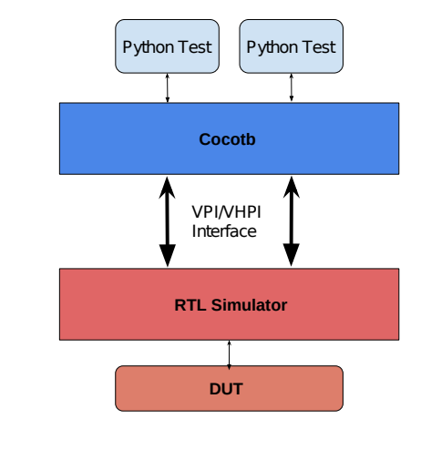

<h2>SI2025_CoCotb<h2>

This page provides an in-depth study material on Cocotb(Coroutine-based Co-simulation Testbench).

<h2>Table Of Contents</h2>
<ul>
  <li><a href="#introduction"> Introduction to Cocotb</a></li>
  <li><a href="#setup">Setting Up The Environmnet</a></li>
  <li><a href="#basics">Cocotb Basics</li>
    <ul>
      <li><a href="#coroutines">Coroutines and Triggers</a></li>
      <li><a href="#dut-interaction">Interacting with the DUT</a></li>
      </ul>
    <li><a href="#tests">Writing Cocotb Tests</a></li>
    <li><a href="#advanced">Advanced Topics</a></li>
    <li><a href="#examples">Practical Examples</a></li>
    <li><a href="#troubleshooting">Common Issues and Debugging</a></li>
    <li><a href="#resources">Resources and Further Reading</a></li>
</ul>
    

<h2 id="introduction">1.Introduction to Cocotb</h2>

Cocotb (Coroutine-based Co-Simulation Testbench) is a Python-based library for testing digital designs in <strong> Verilog</strong>. Unlike traditional testbenches written in HDL,Cocotb allows you to write testbenches in Python , making them easier to read,write and maintain.
<h3> Key Benefits</h3>
<ul>
  <li><strong>Python-based Testing:</strong>Use Python's extensive libraries to simplify complex testing tasks.</li>
  <li><strong>Coroutines for concurrency:</strong>Schedule tasks and trigger events using coroutines.</li>
  <li><strong>Reusable and Modular:</strong>Easily maintain and extend testbenches.</li>
  <li><strong>Provides Interface:</strong>Provides Python interface to control standard RTL simulators(Cadence,Ouesta,VCS,etc.).</li>
  <li>Cocotb is completely free,open source.</li>
</ul>

<h2 id="setup">2.Setting Up The Environment</h2>
<ol>
  <li><strong> Install Python(Python3.6+)recommended :</strong></li>
  <pre><code>sudo apt-get install make python3 python3-pip libpython3-dev</code></pre>
  <li><strong>Check the Python version :</strong></li>
  <pre><code> python3 --version </code></pre>
  <li><strong>Set up a Virtual Environment :</strong></li>
  <pre><code>python3 -m venv file_name </code></pre>
  
Example: Create One Directory & set-up virtual environment
  <pre><code>mkdir venv
  cd venv
  python3 -m venv venv_env
</code></pre>
Note:- here venv is my directory name 

   <li><strong>Activate the virtual environment :</strong></li>
   On Linux:
  <pre><code>source file_name/bin/activate</code></pre>
  On Windows:
  <pre><code>.\cocotb_env\Scripts\activate</code></pre>
  <li><strong>Install Cocotb :</strong></li>
  <pre><code>pip install cocotb</code></pre>
  <li><strong>Install Cocotb Bus :</strong></li>
<pre><code>pip install cocotb[bus] </code></pre>
  <li><strong>Install a Supported Simulator :</strong></li>
  Cocotb supports several simulators,such as Icarus Verilog, ModelSim, Xcelium, and VCS.Here's how to install Icarus Verilig for Open-Source Simulation:
  Linux(use your package manager,e.g.,apt for Debian/Ubuntu):
  <pre><code>sudo apt update
sudo apt install iverilog
  </code></pre>
  <li>Verify Installation :</li>
  <pre><code>python -m cocotb.config
iverilog -v</code></pre>
  <li><strong>Makefile :</strong></li>
   Cocotb requires a Makefile for configuring simulator options and specifying the design files to be tested.Here is the basic structure of makefile:
  <pre><code>SIM ?= icarus
TOPLEVEL_LANG ?= verilog
MODULE = test_module_name

VERILOG_SOURCES = $(PWD)/path_to_verilog_file.v
TOPLEVEL = your_dut_module

include $(shell cocotb-config --makefiles)/Makefile.sim
</code></pre>
Note: Make sure that $Path should be correct.
</ol>
<h2 id="basics">2.Cocotb Basics</h2>

Cocotb is a revolutionary coroutine-based framework that brings the simplicity of Python to the complex world of hardware verification. By allowing developers to write testbenches in Python, Cocotb bridges the gap between software development practices and hardware verification methodologies.
 
 <ol>
   <li><strong>Basic Architecture</strong></li>

The Ingredients:
<ul>
  <li> A Design Under Test(DUT):Verilog or VHDL</li
  <li>A Makefile</li>
  <li>Testbench in Python</li></ul>
  
<strong></strong>Below is the basic architecture of Cocotb:</strong>

   

  
 Working :

  <ul>
    <li>Design Under Test(DUT) runs in standard simulator.</li>
    <li>Cocotb provides interface between simulator and Python.</li>
    <li>Uses Verilog Procedural Interface(VPI) or VHDL procedural Interface(VHPI).VPI -> Verilog and VHPI -> VHDL.</li>
    <li>Python Testbench code can :
    <ul>
      <li> Reach into DUT hierarchy and change values.</li>
      <li>Wait for simulation time to pass.</li>
      <li>Wait for a rising or falling edge of a signal.</li>
    </ul></li>
    
Basic Example :

    
  </ul>

    
    
    

  

