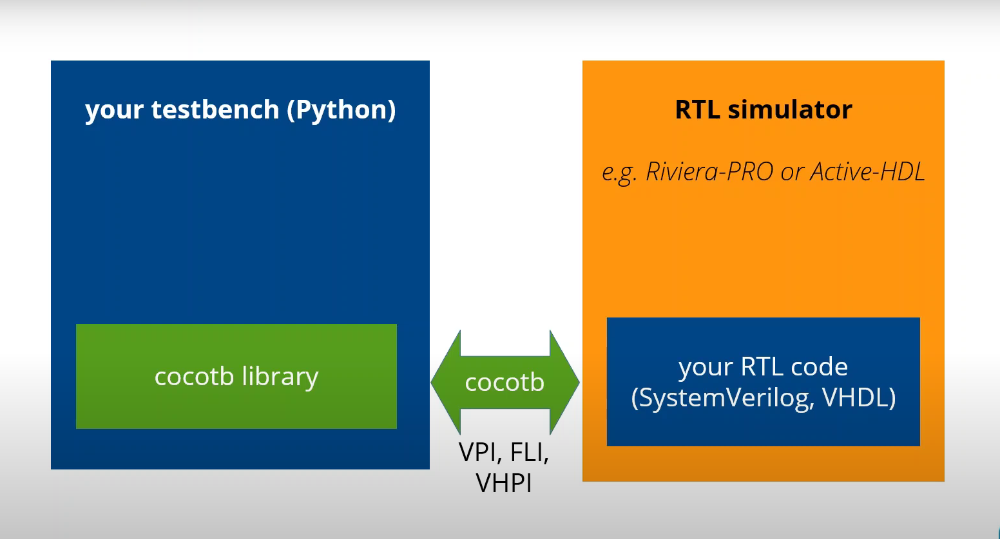

# SI2025_CoCotb
- This page provides an in-depth study material on Cocotb(Coroutine-based Co-simulation Testbench).
##  Table of Contents
- [Introduction to Cocotb](#introduction-to-cocotb)
- [Setting Up The Environment](#setting-up-the-environment)
- [Cocotb Basics](#cocotb-basics)
  - [Coroutines and Triggers](#coroutines-and-triggers)
  - [Interacting with the DUT](#interacting-with-the-dut)
- [Writing Cocotb Tests](#writing-cocotb-tests)
- [Advanced Topics](#advanced-topics)
- [Common Issues and Debugging](#common-issues-and-debugging)
- [Resources and Further Reading](#resources-and-further-reading)

    
## 1. Introduction to Cocotb

Cocotb (Coroutine-based Co-Simulation Testbench) is a Python-based library for testing digital designs in **Verilog**. Unlike traditional testbenches written in HDL, Cocotb allows you to write testbenches in Python, making them easier to read, write, and maintain.

### Key Benefits

- **Python-based Testing:** Use Python's extensive libraries to simplify complex testing tasks.
- **Coroutines for Concurrency:** Schedule tasks and trigger events using coroutines.
- **Reusable and Modular:** Easily maintain and extend testbenches.
- **Provides Interface:** Provides a Python interface to control standard RTL simulators (Cadence, Questa, VCS, etc.).
- Cocotb is completely free and open source.

## 2. Setting Up The Environment

To get started with Cocotb, follow these steps:

1. **Install Python (Python 3.6+ recommended):**

   Use the following command to install Python and its essential dependencies:

   ```bash
   sudo apt-get install make python3 python3-pip libpython3-dev

2. **Verify the Python Version:**

   Ensure Python is installed correctly by checking its version:

   ```bash
   python3 --version
3. **Set up a Virtual Environment:**

   Create a virtual environment using the following command:

   ```bash
   python3 -m venv file_name_env

### Example: Create One Directory & Set Up Virtual Environment
```bash
mkdir venv
cd venv
python3 -m venv venv_env
```
### What each command does:

1. **`mkdir venv`** – This creates a directory called `venv` where you will set up your virtual environment.
2. **`cd venv`** – This changes the current directory to the `venv` directory.
3. **`python3 -m venv venv_env`** – This creates a virtual environment named `venv_env` inside the `venv` directory.

- **Activate the virtual environment :**
  - On Linux:
    ```bash
    source file_name/bin/activate
    ```
  - On Windows:
    ```bash
    .\cocotb_env\Scripts\activate
    ```
  - **Install Cocotb :**
  ```bash
  pip install cocotb
  ```
  - **Install Cocotb Bus :**
    ```bash
    pip install cocotb[bus
    ```
  - **Install a Supported Simulator :**
    Cocotb supports several simulators,such as Icarus Verilog, ModelSim, Xcelium, and VCS.Here's how to install Icarus Verilig for Open-Source Simulation:
  - **Linux (use your package manager, e.g., apt for Debian/Ubuntu):**
  ```bash
  sudo apt update
  sudo apt install iverilog
  ```
  - **Verify Installation:**
  ```bash
  python -m cocotb.config
  iverilog -v
  ```
- **Makefile:**
  Cocotb requires a Makefile for configuring simulator options and specifying the design files to be tested. Here is the basic structure of the Makefile:
  ```makefile
  SIM ?= icarus
  TOPLEVEL_LANG ?= verilog
  MODULE = test_module_name

  VERILOG_SOURCES = $(PWD)/path_to_verilog_file.v
  TOPLEVEL = your_dut_module

  include $(shell cocotb-config --makefiles)/Makefile.sim
  ```
  -**We can make one Makefile for Multiple design**
  

  
- Note: Make sure that $Path should be correct.
## 3. Cocotb Basics

Cocotb is a revolutionary coroutine-based framework that brings the simplicity of Python to the complex world of hardware verification. By allowing developers to write testbenches in Python, Cocotb bridges the gap between software development practices and hardware verification methodologies.

### 1. **Basic Architecture**

#### The Ingredients:
- **A Design Under Test (DUT):** Verilog or VHDL.
- **A Makefile:** To manage the build and simulation process.
- **Testbench:** Written in Python using Cocotb.

**Below is the basic architecture of Cocotb:**

<table>
    <tr>
        <td></td>
        <td></td>
    </tr>
</table>
### Working:

- **Design Under Test (DUT):** Runs in a standard simulator.
- **Cocotb:** Provides an interface between the simulator and Python.
- **Interfaces Used:**
  - **Verilog Procedural Interface (VPI):** For Verilog designs.
  - **VHDL Procedural Interface (VHPI):** For VHDL designs.

- **Python Testbench Code Capabilities:**
  - Reach into DUT hierarchy and change values.
  - Wait for simulation time to pass.
  - Wait for a rising or falling edge of a signal.

### Basic Example:
DUT of `xor_gate`:

```verilog
// xor_gate.v
module xor_gate (
    input wire a,
    input wire b,
    output wire y
);
    assign y = a ^ b;  // XOR gate logic
endmodule
```

### Testbench in Python

```python

import cocotb
from cocotb.triggers import Timer

@cocotb.test()
async def test_xor_gate_simple(dut):
    """Test XOR gate with simple inputs"""

    # Test Case 1: a=0, b=0, y should be 0
    dut.a.value = 0
    dut.b.value = 0
    await Timer(1, units='ns')
    assert dut.y.value == 0, f"Test failed with a = 0, b = 0, expected y=0, got y={dut.y.value}"

    # Test Case 2: a=0, b=1, y should be 1
    dut.a.value = 0
    dut.b.value = 1
    await Timer(1, units='ns')
    assert dut.y.value == 1, f"Test failed with a = 0, b = 1, expected y=1, got y={dut.y.value}"

    # Test Case 3: a=1, b=0, y should be 1
    dut.a.value = 1
    dut.b.value = 0
    await Timer(1, units='ns')
    assert dut.y.value == 1, f"Test failed with a = 1, b = 0, expected y=1, got y={dut.y.value}"

    # Test Case 4: a=1, b=1, y should be 0
    dut.a.value = 1
    dut.b.value = 1
    await Timer(1, units='ns')
    assert dut.y.value == 0, f"Test failed with a = 1, b = 1, expected y=0, got y={dut.y.value}"
```
- In the above example, the `@cocotb.test()` decorator marks the `test_xor_gate_simple` function as a test.
- The test function accepts a `dut` (device under test), which is the XOR gate module, as its argument.

### Assertion Check:
  - For each case, the test uses an `assert` statement to verify that the output matches the expected result.
  - If the assertion fails (i.e., the output is not as expected), an error message is printed showing the input values and the actual result.

### Use of Timer:
  - The `Timer(1, units='ns')` is used to wait for 1 nanosecond after changing the inputs, allowing the circuit to settle before checking the output.

### Test Completion:
  - If all assertions pass, the test completes successfully without any error messages.
  - If any assertion fails, the test stops at the failed test case and reports the failure.

### **Coroutines** and **Triggers**

Cocotb uses **coroutines** and **triggers** to manage timing and events. This allows tasks to run concurrently within the same test, enabling the suspension and resumption of execution using `await`.

**Coroutines** help run multiple test tasks at once, even if they involve waiting for different times or events.

- A coroutine in Python is defined with `async def`
- Cocotb **coroutines** typically represent test steps or procedures that involve waiting for signals or time delays.

**Triggers** are events that can be awaited by **coroutines**. They are used to pause a **coroutine** until a specific condition, time delay, or signal change occurs in the simulation. Cocotb provides various built-in **triggers**.

### Example of **Coroutines** with **Triggers** in Cocotb
```python
import cocotb
from cocotb.triggers import Timer, RisingEdge, FallingEdge

@cocotb.test()
async def test_example(dut):
    print("Test started")
    
    # Wait for a specific time period
    await Timer(100, units="ns")
    print("Waited for 100 ns")

    # Wait for a rising edge on the clock signal
    await RisingEdge(dut.clk)
    print("Detected rising edge of the clock")

    # Wait for a falling edge on the clock signal
    await FallingEdge(dut.clk)
    print("Detected falling edge of the clock")

    # Wait for a combination of multiple edges
    await Combine(RisingEdge(dut.clk), FallingEdge(dut.reset))
    print("Detected rising edge of clk and falling edge of reset")
```
In this example:

- The coroutine first waits for 100 ns using the Timer trigger.
- Then, it waits for a rising edge on `dut.clk`.
- It then waits for a falling edge on `dut.clk`.
- Finally, it waits for both a rising edge on `clk` and a falling edge on `reset` simultaneously.

**Note:** The above example is for understanding the concept of **coroutines** and **triggers** in Cocotb. It demonstrates how coroutines can be used to wait for specific events such as time delays or signal edges using various triggers like `Timer`, `RisingEdge`, and `FallingEdge`.

### Interacting with the DUT

Each signal in the DUT can be accessed directly as an attribute of the `dut` object:

```python
dut.signal_name.value = 1
await RisingEdge(dut.clk)
assert dut.output_signal.value == expected_value
```
## 4. Writing Cocotb Tests

Structure a Cocotb test with setup, stimulus, assertions, and logging.

```python
import cocotb
from cocotb.triggers import RisingEdge

@cocotb.test()
async def test_simple(dut):
    """Basic test that toggles a clock and checks output."""
    dut.reset.value = 1
    await Timer(5, units='ns')
    dut.reset.value = 0

    for i in range(10):
        await RisingEdge(dut.clk)
        dut.input_signal.value = i
        assert dut.output_signal.value == expected_output(i)
```
## 5. Advanced Topics

### Clock and Reset Management

```bash
async def clock_gen(dut, period_ns=10):
    while True:
        dut.clk.value = 0
        await Timer(period_ns / 2, units='ns')
        dut.clk.value = 1
        await Timer(period_ns / 2, units='ns')
```
### Using Assertions and Logging

Assertions help validate DUT outputs. Cocotb also provides `cocotb.log` for detailed logging.

```bash
dut.a.value = 1
dut.b.value = 1
await Timer(1, units='ns')
assert dut.y.value == 0, f"Test failed with a = 1, b = 1, expected y=0, got y={dut.y.value}"
```
```bash
cocotb.log.info("Simulation started")
assert dut.output_signal.value == expected_value, "Test failed: Output did not match"
```
---

## 6. Common Issues and Debugging

---

## 6. Common Issues and Debugging

- **Simulator Path Issue:** Ensure the simulator is in your `$PATH`.
- **Signal Scoping:** Use `dut.<signal>` to access DUT signals.
- **Timing Conflicts:** Use `await Timer()` to manage timing precisely.
- **Indentation in Python Testbench:** Ensure correct indentation to avoid syntax errors and maintain code structure in your Python testbench.


---

## 7. Resources and Further Reading

- [Cocotb Documentation](https://cocotb.readthedocs.io/)
- [Python Documentation](https://docs.python.org/3/)
- [Cocotb GitHub Repository](https://github.com/cocotb/cocotb)
- [Coroutines and Tasks](https://docs.cocotb.org/en/stable/coroutines.html)
- [Cocotb.org](https://docs.cocotb.org/en/stable/)


